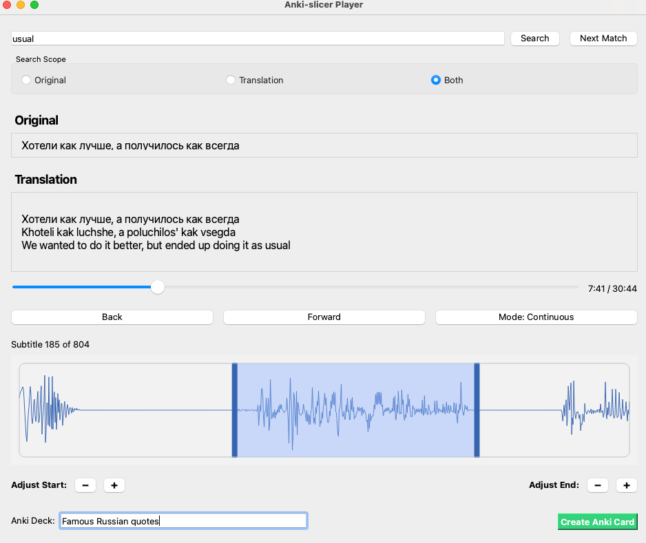

🎧 Anki‑Slicer

Anki‑Slicer is a utility that lets you take an audio file (MP3, WAV, etc.) plus two SRT subtitles (original + translation), preview and flag sentences you want to learn, and then export it into an Anki flashcard deck. 

It’s designed for language learners who want to build rich, sentence‑level flashcards with audio + text, all in just a few clicks. 

## ✨ Features

* ⏯️ Precise adjustment of audio selection (no more clipped audio or extra sounds).
* 🕹 Slider & Time Display to seek anywhere in the audio.
* 🔎 Search subtitles (original, translation, or both) and jump through results.
* 📤 Export flagged items into Anki via AnkiConnect — creates cards automatically.
   

## 📦 Prerequisites

* Python 3.9 or later
* [Anki](https://apps.ankiweb.net/) with the AnkiConnect add‑on installed and running.
* An audio file and two SRT files:
    * Original transcript (same language as the audio).
    * Translation of the original text.*

💡 Tip: I personally use McWhisper (paid app) which can generate accurate SRTs (original and translation) and then export  the audio from YouTube videos etc. Other workflows are possible — e.g. extracting captions from YouTube, generating with whisper.AI, etc.

## 🚀 Installation

### Easy install (from PyPI) – **recommended**

pip install anki-slicer

### Install directly from GitHub
pip install git+https://github.com/LeeHunter/anki-slicer.git

### Developer install (for contributors)
git clone https://github.com/LeeHunter/anki-slicer.git
cd anki-slicer
pip install -e .

## Preview

## Usage

   In a terminal run the following command: python -m anki_slicer

    Ensure Anki (with the AnkiConnect add-on) is running.
    Launch Anki‑Slicer:

    python main.py

    Select your:
        Audio file
        Original SRT
        Translation SRT
    Use the controls:
        ▶ Forward and Back buttons
        Mode toggle = Continuous vs. Auto‑Pause playback
        Use the slider to jump around
        🔍 Search subtitles (Original / Translation / Both)
        =/- buttons for precise editing of the selection length
        
    
    Click Create Anki Card → card is created in your AnkiSlicer deck. You can specify the name of the Anki deck.
    If a deck with that name doesn't exist it will be created. 

🛠 Tip

Before using Anki-Slicer you might want to edit your translation SRT before loading:
For example you can use AI to add explanations, grammar notes, transliterations etc. 
This text appears on the answer side of the Anki card. Note that Anki uses HTML formatting. 
    

## 🤝 Contributing

Contributions are welcome!
Ideas, bug reports, feature requests → open an Issue.
Pull requests are encouraged — new features (UI tweaks, extra export formats, etc.) are fair game.

## ⚖️ License

This project is licensed under the MIT License — see LICENSE for details.

## 🧪 Status

Currently tested only on macOS. Windows/Linux should work but are not yet validated.
Feedback and testing reports are welcome!
