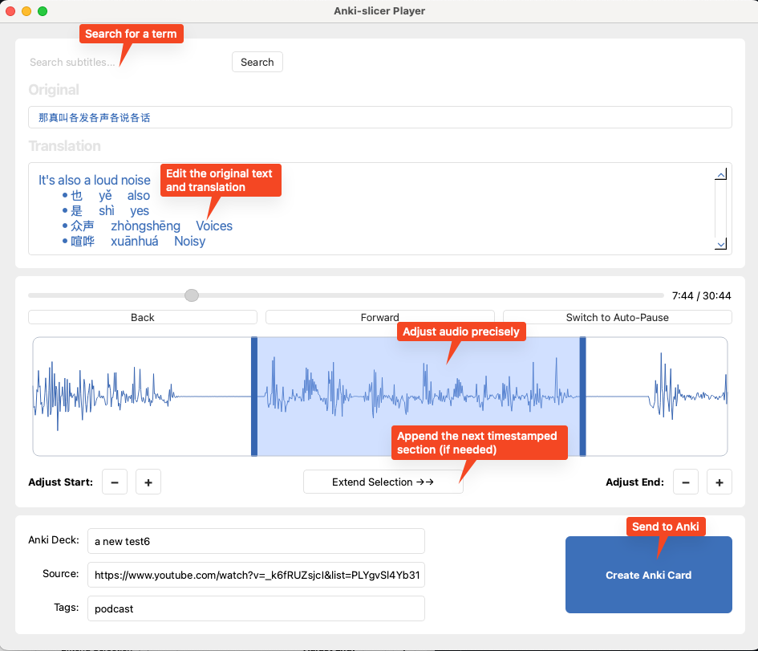

🎧 Anki‑Slicer

Anki‑Slicer is a 'sentence mining' utility that lets you take an audio file (MP3, WAV, etc.) plus two SRT subtitles (original + translation), preview and flag sentences you want to learn, and then export it into an Anki flashcard deck. 

It’s designed for language learners who want to build rich, sentence‑level flashcards with audio + text, all in just a few clicks. 

## ✨ Features

* ⏯️ Precise adjustment of audio selection (no more clipped audio or extra sounds).
* 🕹 Slider & Time Display to seek anywhere in the audio.
* 🔎 Search subtitles (original, translation, or both) and jump through results.
* 📤 Export selection into Anki via AnkiConnect — creates cards automatically.
   

## 📦 Prerequisites

* Python 3.9 or later
* [Anki](https://apps.ankiweb.net/) with the AnkiConnect add‑on installed and running.
* FFmpeg installed and on your PATH (required by pydub for reading/exporting audio).
  - macOS: `brew install ffmpeg`
  - Windows: `choco install ffmpeg` (or download from ffmpeg.org and add to PATH)
  - Linux: `sudo apt-get install ffmpeg` (Debian/Ubuntu) or your distro equivalent
* An audio file and two SRT files:
    * Original transcript (same language as the audio).
    * Translation of the original text.*

💡 Tip: I personally use MacWhisper (paid app) which can generate accurate SRTs (original and translation) and then export  the audio from YouTube videos etc. Other workflows are possible — e.g. extracting captions from YouTube, generating with whisper.AI, etc.

## 🚀 Installation

### Easy install (from PyPI) – **recommended**

pip install anki-slicer

### Install directly from GitHub
pip install git+https://github.com/LeeHunter/anki-slicer.git

### Developer install (for contributors)
git clone https://github.com/LeeHunter/anki-slicer.git
cd anki-slicer
pip install -e .

## Preview

## App Icon

You can customize the app’s icon shown in the window/dock/taskbar by placing a PNG at `images/app_icon.png`.

- Recommended: 512×512 or 256×256 PNG with transparency (runtime).
- Source asset: 1024×1024 PNG for future scaling.

At runtime, the launcher sets the icon automatically if the file exists. For bundled apps:

- Windows: provide a multi-size `.ico` (16→256 px) to your bundler.
- macOS: provide an `.icns` (16→1024 px + 2x variants) to your bundler.

## Usage

    Ensure Anki (with the AnkiConnect add-on) is running.
    Launch Anki‑Slicer:

    anki-slicer
    # or
    python -m anki_slicer

    Select your:
        Audio file
        Original SRT
        Translation SRT
    Use the controls:
        ▶ Forward and Back buttons
        Mode toggle = Continuous vs. Auto‑Pause playback
        Use the slider to jump around
        🔍 Search subtitles (Original / Translation / Both)
        =/- buttons for precise editing of the selection length
        
    
    Click Create Anki Card → card is created in your AnkiSlicer deck. You can specify the name of the Anki deck.
    If a deck with that name doesn't exist it will be created. 

🛠 Tip

Before using Anki-Slicer you might want to edit your translation SRT before loading:
For example you can use AI to add explanations, grammar notes, transliterations etc. 
This text appears on the answer side of the Anki card. Note that Anki uses RTF formatting. 
    

## Conversation Log Workflow

Codex conversations can disappear after session resets. Keep a private log locally (ignored by Git) with:

- `python scripts/append_conversation_log.py --speaker user "Message"` to capture quick notes.
- `python scripts/append_conversation_log.py --speaker assistant --stdin < transcript.txt` (or `pbpaste | python scripts/append_conversation_log.py --speaker assistant --stdin`) for longer chunks.
- Logs live in `conversation_logs/` which is already ignored via `.gitignore`.
- Each entry is timestamped and tagged with the provided speaker label.

## 🤝 Contributing

Contributions are welcome!
Ideas, bug reports, feature requests → open an Issue.
Pull requests are encouraged — new features (UI tweaks, extra export formats, etc.) are fair game.

### Localization

Anki-Slicer is being prepared for translation. UI strings now go through Qt's
translation system (`anki_slicer/i18n.py`). To work on translations:

- Wrap new UI text with Qt's translation helpers, e.g. `self.tr("Create Anki Card")`
  inside widgets (or `QCoreApplication.translate("Context", "Text")` outside of
  QObject classes).
- Run `pylupdate6 anki_slicer/*.py -ts anki_slicer/locale/anki_slicer_fr.ts` (swap the
  locale code) to refresh or create translation catalogs, then `lrelease` to compile
  the corresponding `.qm` bundles when you're ready to ship.
- Edit the `.ts` file with Qt Linguist or another editor and commit both the
  updated `.ts` and compiled `.qm` outputs.

Set the environment variable `ANKI_SLICER_LOCALE` (for example `fr` or `es_ES`)
before launching to force a specific translation during development. Without a
matching `.qm` file the app falls back to English.

### Accessibility

Keep accessibility in mind while developing features. Refer to
[`docs/accessibility_checklist.md`](docs/accessibility_checklist.md) for the
current list of items to verify (screen reader support, keyboard navigation,
contrast, etc.). Update the checklist as new workflows—such as the planned
YouTube integration—introduce additional requirements.

## ⚖️ License

This project is licensed under the MIT License — see LICENSE for details.

## 🧪 Status

Currently tested only on macOS. Windows/Linux should work but are not yet validated.
Feedback and testing reports are welcome!
